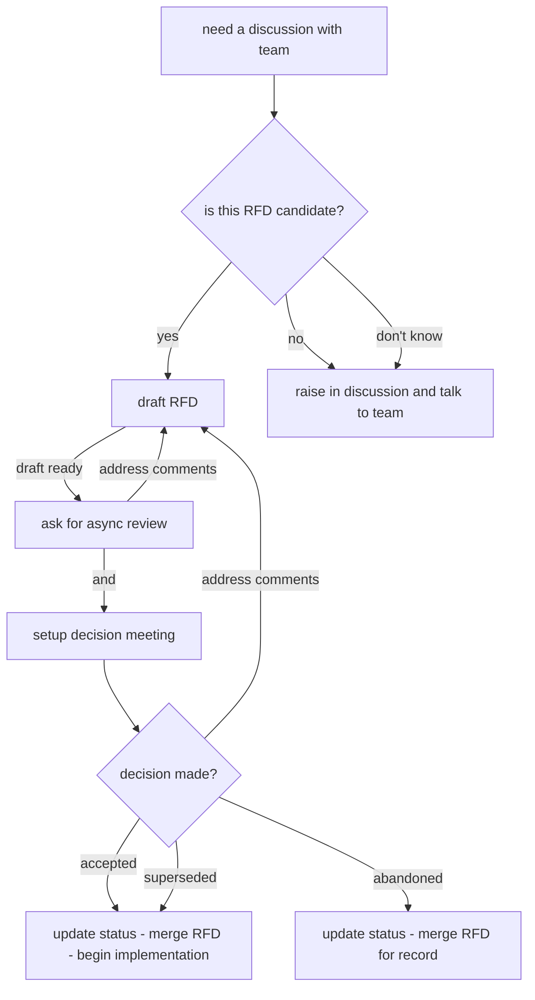

+++
title = "introducing rfd, again"
slug = "rfd"
date = 2026-02-08
+++

I'm a RFD fanboy! I love reading them, and I wish for a workplace which follows
them. I'm a 10x engineer if I write an RFD beforehand (even a minimal one for
myself). At work, I always find rough edges when "my code is compiling (iykyk)"
and writing specifics to improve these edges makes it concrete given team
setting and other workplace constraints.

Getting my team to talk based on a common medium is a winner. Any common medium,
be it RFDs, emails, workshops, "a sprint ceremony" (whatever makes you 
communicate easily). RFD is more productive than meetings and in absence of an
existing established team culture, I lobby for RFDs (or equivalent) to share 
technical improvements (features or tech-debt).

I'm a huge proponent of [Boring Tech Club][1] and I strongly believe throwing
new-shiny-tech is never an answer to any problem. Having RFDs as an enforced
approach cuts all suggestions that don't have legs. A log of RFDs can quickly
show (in metrics) the innovation tokens spent by team and prevent team from
investing time and effort into a new thing.

Following is a sanitized `001-rfd-template` that I submitted to my monorepo/docs
folder seeking comments and commitment from team. This is a reference for
myself because I've written this from scratch multiple times and when I want to
do this again in future, with a new team or org, I don't want to find myself
finding different ways to make the same point.

---

## Summary

Introducing Requests for Discussion (RFDs) as a lightweight process for
proposing and discussing significant decisions for our team.

An RFD is a numbered document that describes a proposal for a significant
change, decision, or initiative. The intention is to have a structured method to
document ideas, gather feedback from team members, and reach consensus before
implementation.

## Context

Currently, significant decisions are made informally — in standups, chats, or
1:1s — with no shared record. New team members lack visibility into past choices
and their rationale. As the team and codebase grow, this creates repeated
debates and inconsistent practices.

A structured discussion process addresses this in three ways:
- **A thinking tool** - Writing forces clarity of thought. Most ideas are vague
and come to life during implementation. However, overall direction for team is
to achieve our OKRs and writing down an idea makes it concrete and tests its
alignment with team vision and aspirations
- **A discussion artifact** - it provides a focal point for feedback. Instead of
a decision made in isolation or in absence of historical context, RFDs provide
an opportunity for team to transparently share ideas, and gather feedback
- **A decision record** - it documents what was decided and why. A new joiner
can go through previous RFDs and understand our culture, way of working and past
choices about architecture, technology and tooling.

This is not a new idea. There are many successful inspirations in both open
source and enterprise settings:
- [Oxide's RFDs](https://rfd.shared.oxide.computer/) is a piece of art
- [Joyent's RFDs](https://github.com/joyent/rfd) is another enterprise RFD
building their products with RFDs
- [Rustlang RFCs](https://github.com/rust-lang/rfcs) in open-source setting
drives development of a performant systems language
- [PEP](https://legacy.python.org/dev/peps/pep-0001/) or Infamous Python
Enhancement Proposal
- [SPIP](https://spark.apache.org/improvement-proposals.html) are improvement
proposals for Apache Spark

## Proposed Solutions

### Option A: Requests for Discussion (RFDs)

A narrative, pre-decision document that captures a proposal, surfaces
alternatives, and drives the team to an explicit decision before implementation
begins. Flexible in structure; suitable for architecture, process, and standards
decisions alike.

**Trade-offs:** Slightly more overhead than informal discussion; requires
discipline to maintain.

### Option B: Re-use architecture review forums and ADRs

A formal architecture review forum may already exist for security, privacy,
architecture, or cross-team governance topics. Those forums are useful, but they
are often too heavyweight for everyday team-level technical decisions.

**Trade-offs**:
- ADRs are a decision log, not a discussion tool. They do not
support the pre-decision discussion and async feedback gathering that the team
currently lacks
- Given the scope of these forums, they may not be suited for routine team-level
architecture, process, or tooling decisions.


### Option C: Do Nothing

Continue making decisions informally in standups and chats, with no written
record.

**Trade-offs:** Zero overhead, but decisions remain undocumented, context is
lost when people leave, and the same debates recur.

### Recommendation

Option A. The team's primary gap is not record-keeping but structured
pre-decision discussion. RFDs address this directly, while remaining flexible
enough to scale as the team grows. ADRs can be adopted later if a lighter
post-decision log becomes useful.

## When to Write an RFD?

Write an RFD when you're considering:

- **Architecture decisions** - New data pipelines, schema changes, technology
choices. Few practical examples are:
    - Decoupling a tightly-coupled workflow
    - CI/CD strategy for deployment pipelines
    - Standardizing project scaffolding and release automation
- **Process changes** - Workflow modifications, team practices, tooling
adoption. Few practical examples are:
    - Using RFD for discussions
    - Using monorepos and git to track all code changes
    - Way of working improvements
    - Using precommit hooks
- **Standards** - Naming conventions, coding patterns, documentation practices.
Few practical examples are:
    - Unity Catalog Design
    - Python or SQL Coding standard
    - Using linters for Python and SQL
- **Cross-team initiatives** - Changes affecting multiple teams or systems. Few
practical examples are:
    - Shared data catalog design
    - Cross-team development workflows
    - Governance for shared platform usage
    - Temporary environment housekeeping workflow

**Don't** write an RFD for:

- Topics that require formal security, compliance, or architecture approval
- Bug fixes
- Minor refactoring
- Documentation updates
- Changes with obvious solutions and minimal impact

**Rule of thumb**: If you'd naturally discuss it with the team before
implementing, consider an RFD.

## RFD Lifecycle

There are a few things to clarify before we touch upon the lifecycle of an RFD.

### Who is Involved?

| Role        | Responsibility                                              |
|-------------|-------------------------------------------------------------|
| Author(s)   | Writes the proposal, addresses feedback, drives to decision |
| Reviewers   | Team members who provide feedback                           |
| Stakeholders| Anyone affected by the decision (are kept informed)         |

Anyone can author an RFD. All team members are encouraged to review and comment.

### What is the process?



This diagram explains the approach a RFD comes to be. To understand keywords
like *supersedes*, *abandoned*, *review* or *implementation* in above diagram
better, lets consider the states that an RFD can have:

:::mermaid
graph LR
    A[Draft] --> B[Review]
    B --> C[Accepted]
    B --> D[Abandoned]
    C --> E[Superseded]
:::

| Keyword     | Description                                   |
|-------------|-----------------------------------------------|
| Draft       | author is refining his thoughts               |
| Review      | when discussing RFD with team                 |
| Accepted    | approved and ready for implementation         |
| Abandoned   | withdrawn or rejected (document why)          |
| Superseded  | replaced by a newer RFD (link to replacement) |


**It starts with a trigger**

When a team member encounters a topic that requires discussion as explained in
above section "When to write an RFD?", there is a trigger to ask around and
understand if there is a pattern that our team follows for "topic". If someone
is not clear about this, they can consult other team members or raise this in
common forum/chat.

Some topics are not large enough to warrant a written document and they can be
suggested in a common forum/chat. In case there are disagreements, it could hint
that a RFD is required, even if its a short one. One can use their discretion to
decide this based how strong the trigger is.


**Writing a draft**

Once you have decided to request a discussion, it is quite procedural to create
a document explaining details about the topic, that helps make a decision.
- Create a feature branch from the repository's main branch
- Create a new markdown file: `docs/rfd/draft_SHORT_TITLE.md` (no number yet)
- Use the template as a starting point, or structure it your own way. The
template below is optional guidance. If you have a clear structure that covers
the essence of your proposal, feel free to adapt or skip sections. The goal is
clarity, not bureaucracy.
- At this point, RFD document is in **Draft** state (in metadata)
- Open a PR to track changes

Some suggestions that help you write a better RFD doc
- RFD doc starts with *Summary* and *Context* to the topic being discussed
- An RFD doc should have *Priorities and Requirements (ranked)* list which
grounds the discussion and keeps everyone aligned on the original requirements.
A misalignment in requirement in a discussion corrects the direction taken by
solution early on. This should be a ranked list to make the priorities clear
for implementation 
- Template below shows an **Option C: do nothing!** in *Proposed Solution*
section which indicates that sometimes, for a problem, doing nothing is also a
viable option. This indicates that there is a topic we are discussing but it is
not the most important one that we want to address right now. This option
enables the author to raise a topic for discussion and enables the group to
discuss, decide and pause on implementation till time is right.
- There should be a *Timeline* at the end of RFD which indicate the next actions
that would be taken and by whom


**Gathering feedback/review**

Once a draft RFD doc is ready, a PR can be raised which serves as a great medium
to collect async feedback from from team. 

At this phase, it is important to tag right people on the PR. One should tag
everyone:
- who will be affected by the decision (they need to know)
- has relevant experience (they can improve the decision)
- has authority over certain area (they need to approve)
- will implement it (they will spot practical issues with options)

But it shouldn't be the entire company; it should be a carefully chosen list. The
message should say "Please read this RFD and leave your comments by [date]. We
will have a decision meeting on [date]". It also helps to be clear about what is
needed from person being tagged; not everyone needs to analyse the options.

A period of 2-3 days will give enough time for team to read and share async
comments on the PR. Async comments make people think before responding and they
can research the topic; sleep on it and it produces better feedback than a call
where people are on spot.

Some feedback and questions can be addressed even before the decision meeting
and best RFDs are the ones where consensus is built before the meeting itself.

Sometimes there are no comments
- The decision is not important enough. Maybe formal process is not required
here.
- People are too busy. Pinging people individually asking "Hey, I really need
your input on Section 3"
- It's too long or complex. Write a TL;DR
- People agree but are silent. Explicitly ask them to "+1/approve on RFD PR"


**Decision meeting**

This is not a presentation meeting. Everyone should have already read the RFD
and commented. If they haven't, its on them. This is a working session which 
- sets the context
- addresses open questions
- discuss options
- decision

The RFD author runs the meeting and it should typically be 5-8 people to
maximize on decision making. Large meetings turn into updates and decision
become harder.

If there is no consensus, there are a few options
- Escalate: provide context to leadership and let them decide for everyone. This
shouldn't be considered as failure; leadership is for this reason
- Time-box: "Let's try Option B for 2 months and revisit". Nothing is permanent;
and so is this decision
- Do more research: if the disagreement is factual e.g. "will this scale?",
maybe it is better to build a proof of concept to make decision easier
- Smaller scope: decide on a subset of the problem


**Finalizing an RFD**

Once a decision is made, update state to **Accepted**, assign the next available
RFD number and rename the file `docs/rfd/NNN_short_title.md`. If the proposal is
withdrawn or rejected, update state to **Abandoned** and briefly document why -
this is valuable context for future reference. And finally, merge the PR.

Note on RFD numbers: RFD numbers are assigned only when the RFD reaches a
final state (Accepted or Abandoned). While in Draft or Discussion, reference
your RFD by its PR link. When finalizing, pick the next available number.


**Superseding an existing RFD**

Superseded is a special state for when a new RFD replaces an older one. This
happens when requirements evolve significantly or a better approach emerges.

- Draft the new RFD as usual, referencing the old RFD it will replace
- In the new RFD, explain what changed and why the old approach no longer fits
- When the new RFD is accepted:
  - Update the old RFD's state to **Superseded**
  - Add a note at the top of the old RFD linking to the replacement: `Superseded
  by RFD NNN`
- The old RFD remains in the repository as historical context


## Open Questions

`[REDACTED]`

## Timeline

A typical RFD timeline can be lightweight:
- Open for async review for a few working days
- Hold a decision discussion if needed
- Record the accepted/abandoned outcome
- Start implementation or follow-up work

# Appendix

## RFD Template

Use the sections below as a starting point. All sections are optional - include
what's useful for your proposal and skip what isn't. The goal is to communicate
your idea clearly, not to fill out a form.

```markdown
# RFD NNN: Title

| Field       | Value                            |
|-------------|----------------------------------|
| RFD         | <!-- assigned when finalized --> |
| Title       | <!-- descriptive title -->       |
| Author      | <!-- your email -->              |
| State       | `Draft | Review | Accepted | Abandoned | Superseded`|

## Summary
One paragraph. What is this about and why are we discussing it?

## Context
What's the current situation? What problem are we solving? 
Why now? Include relevant constraints, requirements, and background.

## Priorities and Requirements (Ranked)

This is the most important part. List what actually matters for this decision,
in order of importance. Be specific and quantifiable where possible.
1. **[Priority name]** - [Why this matters. What's the business or technical
reason?]
2. **[Priority name]** - [Why this matters?]
3. **[Priority name]** - [Why this matters?]

Example:
1. **Cost** - We're operating at thin margins; any infrastructure cost increase
directly impacts profitability
2. **Development velocity** - Our roadmap depends on shipping three features
this quarter
3. **Operational complexity** - We have a small ops team; anything complex will
create bottlenecks

Note: People often disagree on decisions because they're weighing priorities
differently. Making priorities explicit is where the real decision-making
happens.

## Proposed Solutions

### Option A: [Name]
Description of the approach.

**How this performs against priorities:**
- **Cost:** [How does this affect cost? High/Medium/Low impact and direction]
- **Development velocity:** [How does this affect velocity?]
- **Operational complexity:** [How does this affect ops complexity?]

**Estimated effort:** X weeks/months

**Risk level:** Low/Medium/High

**Other trade-offs:** [Anything else worth noting]

### Option B: [Name]
...

### Option C: Do Nothing
Often you should include this option. Sometimes the answer is "not now".

## Recommendation (Optional!)
Which option do you recommend and why? Focus on how it aligns with the
priorities you outlined above.

## Open Questions
What needs to be resolved during discussion?

## Timeline
When does this decision need to be made? What's driving that deadline?
```


## Using LLMs as editors

I(=Harman) strongly believe that any prose/essay/document that is meant to be
read by humans should be written by humans and reviewed by humans. Generative
AI can produce content (or slop) a lot faster than human can read. This creates
a problem where generated content lacks emotions, convictions and human touch
required to make a concrete decision. Also, the length of document, use of
emojis, and extensive use of bullet points reduces efficacy of explaining
concepts.

LLMs are also good at:
- Researching trade-offs between technologies
- Generate initial draft which can be reviewed/expanded
- Summarize documentation or academic papers about tooling
- Identify edge cases that might be missed
- Catch grammar and spelling errors

These qualities make them good editors; however I recommend writing the RFD in
your own words and using LLM to provide pointers/suggestions. Writing RFDs
entirely using LLM is highly discouraged.

[1]: https://boringtechnology.club/
