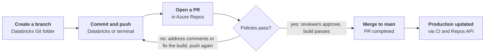

# Git for the Team — 90-Minute Session Outline

2026-10-06 · hrmnjt

## Run of show

The session builds in five layers. Each layer assumes the one before it: the mental model, then local commands, then branches, then Azure DevOps, then Databricks. Your monorepo conventions (Part 6) slot in after Part 5 once you've written them, or run as a 30-minute follow-up.

| Time | Block | Format | Goal: by the end, people can… |
| --- | --- | --- | --- |
| 0:00–0:05 | Opening: why Git, why today | Talk | Say what problem Git solves and what they'll do differently tomorrow |
| 0:05–0:20 | Part 1 — How Git thinks | Whiteboard + slides | Explain a commit, a branch and HEAD without using the word "magic" |
| 0:20–0:40 | Part 2 — Everyday operations | Live terminal demo, people follow along | Clone, stage, commit, push, pull, and read `status` and `log` |
| 0:40–0:55 | Part 3 — Branch, merge, rebase, undo | Demo + one conflict exercise | Make a branch, resolve a conflict, recover from a mistake |
| 0:55–1:10 | Part 4 — Git with Azure DevOps | Screen share of Azure Repos | Push a branch, open a PR, understand why the policies block them |
| 1:10–1:22 | Part 5 — Git from Databricks | Screen share of a workspace | Do the same loop from a Databricks Git folder |
| 1:22–1:30 | Q&A, cheat sheet, homework | Discussion | Know where to go when they're stuck |

Timing tips: Parts 2 and 3 run long when people follow along live. Keep Part 1 at 15 minutes even if it feels slow — it's what makes the rest stick. If you're short on time, cut rebase from Part 3 and keep undo.

## Part 1 — How Git thinks (15 min)

Teach the model first, commands second. This is ThePrimeagen's approach in his Frontend Masters course, which opens with Git's internals before any workflow. People who see commits as a graph stop being scared of branches and resets.

1. **Git stores snapshots, not diffs.** Each commit is a full picture of the project, plus a pointer to its parent commit(s). Same content means the same hash, so Git stores each unique file only once.
2. **The three areas.** Working directory (what you edit) → staging area or index (what goes in the next commit) → repository (`.git`, the saved history). Draw these as three boxes; `add` and `commit` are the arrows between them.
3. **A commit = snapshot + author + message + parent hash.** Its ID is a hash of all of that. Change anything and you get a new commit — that's why "rewriting history" makes new commits instead of editing old ones.
4. **Branches are just labels.** A branch is a file holding one commit hash. Making a branch is free; deleting one deletes no commits.
5. **HEAD = "where you are now".** Usually it points at a branch. "Detached HEAD" means it points straight at a commit.
6. **Local vs remote.** Your laptop has a full copy of the history. `origin/main` is your laptop's last-known copy of the server's `main`, not the server itself.

Optional 3-minute "look under the hood" demo: run `git init`, commit one file, then `ls .git/objects` and `git cat-file -p HEAD`. Show that a commit is a small readable text file.

Check for understanding: ask "if I delete a branch, are the commits gone?" (No — they're still there until garbage collection, and `reflog` can find them.)

## Part 2 — Everyday operations (20 min)

Run this as a live demo on a throwaway repo in Azure Repos, with people typing along. After every command, run `git status` and `git log --oneline --graph --all` so they watch the three areas and the graph change.

| Command | What it does, in terms of Part 1 | Demo moment |
| --- | --- | --- |
| `git config --global user.name / user.email` | Sets who you are in every commit | Do it first; wrong email = unlinked commits in Azure DevOps |
| `git clone <url>` | Copies the whole history and sets up `origin` | Clone the demo repo from Azure Repos |
| `git status` | Shows what's in each of the three areas | Run it after every step |
| `git add <file>` / `git add -p` | Moves changes into the staging area | Show `-p` to stage only part of a file |
| `git commit -m "…"` | Saves the staged snapshot as a new commit | Talk about good messages (what + why) |
| `git log --oneline --graph --all` | Draws the commit graph | Make it an alias: `git lg` |
| `git diff` / `git diff --staged` | Working vs staged / staged vs last commit | Ties straight back to the three boxes |
| `git fetch` | Downloads new commits; changes nothing of yours | Show `origin/main` moving ahead of `main` |
| `git pull` | `fetch` + merge (or rebase) into your branch | Explain it's two steps in one |
| `git push` | Uploads your commits and moves the remote branch | First push of a branch needs `-u origin <branch>` |
| `git restore <file>` | Throws away unstaged edits to a file | Warn: this one can't be undone |
| `git stash` / `git stash pop` | Shelves unfinished work so you can switch tasks | "Boss needs a hotfix now" scenario |
| `.gitignore` | Keeps secrets, data and build output out of Git | Show one for Python/Databricks: `.venv/`, `*.pyc`, `.env` |

Exercise (5 min): everyone adds one line to a shared `attendees.md`, commits, pulls and pushes. The second person to push hits "rejected — fetch first", which sets up Part 3 nicely.

## Part 3 — Branch, merge, rebase, undo (15 min)

The point of this part: mistakes are recoverable, so people should stop being afraid to try things. Draw the graph before and after each command.

**Branching and merging (6 min)**

- `git switch -c feature/x` makes a branch and moves to it; `git switch main` goes back.
- `git merge feature/x`: show a fast-forward (just moves the label) and a merge commit (two parents).
- Conflict exercise: two people edit the same line in `attendees.md`. Walk through the `<<<<<<< ======= >>>>>>>` markers, fix the file, `git add`, `git commit`. Same steps again in Azure DevOps and Databricks later.

**Rebase (4 min, cut if short on time)**

- `git rebase main` replays your commits on top of the latest `main`, so history is a straight line.
- One rule: **never rebase commits other people already pulled.** Rebase makes new commits, so a shared branch would need a force push.
- For beginners, merge is the safe default. Databricks' own docs say the same.

**Undo cheat sheet (5 min)** — the slide people will photograph:

| I want to… | Command | Safe on shared branches? |
| --- | --- | --- |
| Discard edits to a file | `git restore <file>` | Yes (local only) |
| Unstage a file | `git restore --staged <file>` | Yes |
| Fix my last commit's message or add a forgotten file | `git commit --amend` | Only if not pushed yet |
| Undo a commit that's already pushed | `git revert <hash>` | Yes — adds a new "undo" commit |
| Move my branch back, keep the changes | `git reset --soft <hash>` | Only if not pushed yet |
| Throw away commits and changes | `git reset --hard <hash>` | Only if not pushed yet |
| Find a commit I "lost" | `git reflog` | Yes — your safety net |

Pointer for later self-study, not this session: `cherry-pick`, `rebase -i`, `bisect`, `worktree` (all covered in ThePrimeagen's course).

## Part 4 — Git with Azure DevOps (15 min)

Azure Repos is the "remote" from Part 2. Everything after this is just how the team agrees to use it. Screen-share the real project, not slides.

1. **Find the repo and clone it (2 min).** Repos → Files → Clone. Show the HTTPS URL and the "Generate Git credentials" option. Mention Git Credential Manager so people sign in with Entra ID instead of copying tokens.
2. **Branches page (2 min).** Repos → Branches. Show your naming convention (for example `feature/<ticket>-short-name`) and that the server's `main` is the one `origin/main` mirrors.
3. **Why you can't push to `main` (4 min).** Open the branch policies on `main` and explain each one you use:
    - Require a minimum number of reviewers
    - Check for linked work items
    - Check for comment resolution
    - Limit merge types (for example squash only)
    - Build validation (the pipeline must pass)
    - Automatically included reviewers (code owners for a path)
4. **Pull request walkthrough (5 min).** Push a branch from the terminal, then click "Create a pull request". Cover the title and description, linking the work item, reviewers' votes (approve / approve with suggestions / wait for author / reject), the build validation result, comments, and the merge type. Show that a new push to the branch updates the PR.
5. **Resolving a conflict in a PR (2 min).** Show the conflict banner, then fix it locally (`git pull origin main`, resolve, push). Same skill as Part 3.

Decide before the session and put on one slide: branch naming, merge type (squash, rebase, or merge commit), minimum reviewers, and whether a work item is required.

## Part 5 — Git from Databricks (12 min)

A Databricks Git folder (formerly called Repos) is a Git client built into the workspace. It's the same clone → branch → commit → push loop, through buttons instead of a terminal.

1. **Connect once (2 min).** If Azure DevOps and Databricks share the same Entra ID tenant, sign-in is automatic. Otherwise, add an Azure DevOps token under Settings → Linked accounts. Git folders work over HTTPS only, not SSH.
2. **Create a Git folder (2 min).** Workspace → your user folder → Create → Git folder → paste the Azure Repos URL. For a large monorepo, show sparse checkout so people clone only their part.
3. **The Git dialog (5 min).** Open it from the branch name next to the notebook. Demo, in order:
    - Create a branch from `main` (never work on `main` in the workspace)
    - Edit a notebook, see the diff, write a message, Commit & Push
    - Pull to get teammates' changes
    - Merge or rebase from the kebab menu — Databricks recommends merge for beginners
    - Resolve a conflict in the editor, then "Mark as resolved"
    - Reset, which works like `git reset --hard` (warn people)
4. **Then open the PR in Azure DevOps (1 min).** Databricks has no PR screen. Push from the workspace, review in Azure Repos.
5. **Gotchas (2 min)** — put these on one slide:
    - Each person gets their own Git folder; don't share one folder between people
    - Notebooks in source format never carry outputs; `.ipynb` outputs are committed only when an admin setting allows it, so check for data in outputs before pushing
    - Working branches are limited to 1 GB; files over 10 MB can't be viewed in the UI
    - A single Git operation is limited to 2 GB of memory and 4 GB of disk writes
    - Databricks recommends at most 20,000 workspace assets and files per repo
    - No GPG-signed commits from Git folders
    - Production runs from `main`: jobs point at a Git reference, or CI calls the Repos API to update a production Git folder after each merge

If the team also develops locally, mention Databricks Asset Bundles plus VS Code as the next step after this session — that's a good topic for the monorepo layer.

## The team flow on one slide

Show this at the end of Part 5 to tie every part together; it's also the opening slide for Part 6.

**Every change reaches main through a reviewed pull request**

Branching and commits happen in Databricks or the terminal; review, policies and merging happen in Azure DevOps.

## Part 6 — Our monorepo (to fill in later)

This is your layer. It works as a 30-minute follow-up, so the basics have time to settle first. Questions to answer here, each with one real example from the repo:

- [ ] Repo layout: which folder owns what, and who the code owners are
- [ ] Branch naming and the merge type we use into `main`
- [ ] What the PR build validation runs, and how to run the same checks locally
- [ ] How to set up a Databricks Git folder for the monorepo (sparse checkout paths per team)
- [ ] How changes reach dev, test and prod (bundles, pipelines, the Repos API)
- [ ] `.gitignore` rules and what must never be committed (secrets, data extracts, outputs)
- [ ] A "first PR" task every new teammate does in week one

## Pre-work, handouts and follow-up

**Before the session (send 2–3 days ahead, about 20 minutes):**

- Install Git and check `git --version`; Windows users get Git Credential Manager with Git for Windows
- Confirm everyone can open the Azure DevOps project and the Databricks workspace
- Play the first four levels of Learn Git Branching ("Introduction Sequence")

**Handouts:**

- One-page cheat sheet: the Part 2 table plus the Part 3 undo table
- A link to Oh Shit, Git!?! for "I broke something" moments
- The team conventions slide from Part 4

**After the session:**

- Homework: each person opens one real PR in Azure DevOps from a Databricks Git folder, and one from the terminal
- Optional deep dive: ThePrimeagen's course (about 3.5 hours) or chapters 1–3 of Pro Git
- Set up a channel or office hour for Git questions in the first two weeks

## Sources

These are grouped by where they help in the session. Links were found through search; I couldn't open the pages from here, so click through each one before sharing.

| Resource | Type | Use it for |
| --- | --- | --- |
| [Everything You'll Need to Know About Git — ThePrimeagen](https://frontendmasters.com/courses/everything-git/) | Course, Frontend Masters, about 3h 23m (paid) | The internals-first approach behind Part 1; follow-up for rebase -i, bisect, worktrees, reflog |
| [ThePrimeagen on Boot.dev](https://www.boot.dev/teachers/the-primeagen) | Interactive courses (Learn Git 1 and 2) | Hands-on practice after the session |
| [Pro Git book](https://git-scm.com/book/en/v2) | Free book | Chapters 1–3 for basics, chapter 10 for internals |
| [Learn Git Branching](https://learngitbranching.js.org/) | Interactive visualizer | Pre-work; demo branches and rebase live |
| [Visualizing Git](https://git-school.github.io/visualizing-git/) | Interactive visualizer | Drawing the commit graph live in Parts 1 and 3 |
| [Oh Shit, Git!?!](https://ohshitgit.com/) | Recovery recipes | The "undo" handout |
| [How Git Works — Julia Evans](https://wizardzines.com/zines/git/) | Illustrated zine (paid) | Visuals for the mental model ([announcement](https://jvns.ca/blog/2024/04/25/new-zine--how-git-works-/)) |
| [The Zen of Git — Tianyu Pu](https://speakerdeck.com/tianyupu/the-zen-of-git) | Speaker Deck, 2020 | Hand-drawn slides of objects, branches and tags |
| [Git Internals — Jesús Espino](https://speakerdeck.com/jespino/git-internals) | Speaker Deck, 2013 | Data structures behind commits, for Part 1 |
| [Git: An Illustrated Primer — Daniel Cousineau](https://speakerdeck.com/u/dcousineau/p/git-an-illustrated-primer) | Speaker Deck, 2012 | Workflows and branching strategies |
| [Git 201 — Dimitris Tsironis](https://speakerdeck.com/tsironis/git-201) | Speaker Deck, 2013 | Branching models, merging and pull requests |
| [git rebase — Brooke Kuhlmann](https://speakerdeck.com/bkuhlmann/git-rebase) | Speaker Deck | The rebase slot in Part 3 |
| [Set branch policies (Azure DevOps)](https://learn.microsoft.com/en-us/azure/devops/repos/git/branch-policies) | Microsoft docs | Part 4 policies |
| [About pull requests (Azure DevOps)](https://learn.microsoft.com/en-us/azure/devops/repos/git/about-pull-requests) | Microsoft docs | Part 4 PR walkthrough |
| [Use branch merge in Git (training module)](https://learn.microsoft.com/en-us/training/modules/use-branch-merge-git/4-set-branch-policies) | Microsoft Learn | Free self-paced follow-up for Part 4 |
| [Configure Git integration for Git folders](https://learn.microsoft.com/en-us/azure/databricks/repos/repos-setup) | Azure Databricks docs | Part 5 setup and authentication |
| [Run Git operations on Git folders](https://learn.microsoft.com/en-ca/azure/databricks/repos/git-operations-with-repos) | Azure Databricks docs | Part 5 demo steps: branch, merge, rebase, conflicts, reset |
| [Limits and FAQ for Git folders](https://learn.microsoft.com/en-us/azure/databricks/repos/limits) | Azure Databricks docs | Part 5 gotchas slide |
| [CI/CD techniques with Git folders](https://learn.microsoft.com/azure/databricks/repos/ci-cd-techniques-with-repos) | Azure Databricks docs | How merged code reaches production; Part 6 |
| [Entra service principal with Azure DevOps](https://learn.microsoft.com/en-us/azure/databricks/dev-tools/ci-cd/use-ms-entra-sp-with-devops) | Azure Databricks docs | Pipeline authentication; Part 6 |
